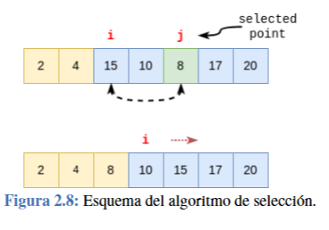
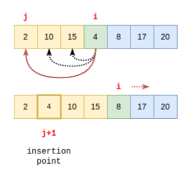
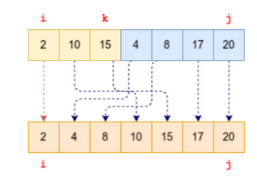
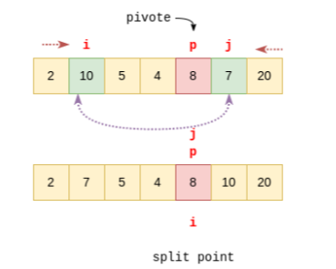
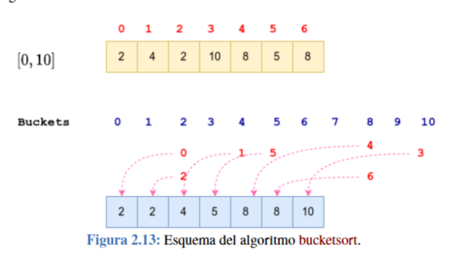
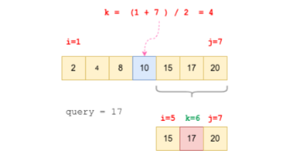

# Examen EDA

### Algoritmos 
Es cualquier proceso computacional bien definido que toma uno o varios valores como entrada y genera una o mas salidas, este debe ser preciso, finito y bien definido.

# Notación Big O  

- Constante: cualquier cosa que no dependa de N como entrada\
```c++
int var = 100*100
```
siempre es igual, esto se ignora, osea es notación O(1)

- Linear: cuando depende linealmente de N\
```c++
int arr[4] = {1, 2, 3, 4};
for (int i = 0; i < 4; ++i) {
    std::cout << arr[i] << std::endl;
}
```

aca podemos ver que el for actúa dependiendo de N, en este caso el arreglo de largo 4 osea podemos decir que es de notación O(N)

- Cuadrática:
```c++
int arr[4] = {1, 2, 3, 4};
for (int i = 0; i < 4; ++i) {
    for (int j = 0; j < 4; j++){
        std::cout << arr[i] << std::endl;
    }
}
```
En este caso, el primer for depende de N y el segundo for también depende de N, por lo tanto, la notación es O(N^2) ya que es N x N.

- Cubica:
```c++
int arr[4] = {1, 2, 3, 4};
for (int i = 0; i < 4; ++i) {
    for (int j = 0; j < 4; ++j) {
        for (int k = 0; k < 4; ++k) {
            std::cout << arr[i] << std::endl;
        }
    }
}
```
En este caso, el primer for depende de N, el segundo for también depende de N, y el tercer for también depende de N, por lo tanto, la notación es O(N^3) ya que seria N x N x N.

- Logarítmica:

```c++
void Log(int number){
    if (number != 0){
        number = number / 2;
    }
    return number;
}
```
Recordemos que en el computador todo se hace en log<sub>2</sub>(), osea la base siempre es 2, ejemplo si elegimos el numero 8, log<sub>2</sub>(8) = 3, y si vemos el código el numero iría así 8 -> 4 -> 2 -> 1, son las mismas cantidades de flechas por decirlo que el resultado del logaritmo por lo que podemos decir que esta en notación O(log(N))

-N log(N): 
```c++
void nlog(int number){
    int n = number;
    while (number > 1){
        number = number/2;
        for (int i = 0; i < n; i++){
            std::cout << i << std::endl;
        }
    }

}
```

aca podemos ver una mezcla de dos algoritmos, el primero un Olog(N) y el segundo un O(N) osea seria N x Log(N) o en otras palabras Nlog(N) que se usa en el caso del radix sort por ejemplo.


## Algoritmos de Ordenación 

Es la ordenación de distintos elementos dentro de una lista 

### Ordenación por selección 
es ir recorriendo el arreglo de entrada y seleccionar el menor de los que faltan por ordenar y es cambiado por el elemento de la posición actual. 



*código en c++*
```cpp
void selectionSort(vector<int>& arr) {
    int n = arr.size();
    for (int i = 0; i < n - 1; ++i) {
        // Find the minimum element in the unsorted portion
        int minIndex = i;
        for (int j = i + 1; j < n; ++j) {
            if (arr[j] < arr[minIndex]) {
                minIndex = j;
            }
        }
        // Swap the found minimum element with the first element of the unsorted portion
        swap(arr[i], arr[minIndex]);
    }
}
```
Se puede ver aca que entra un arreglo a la función, primero sacamos el largo del arreglo que se definirá como *n* luego entramos en el ciclo for que encontrara el valor mínimos que usaremos, luego entra a otro for que parte desde el valor mínimo en adelante, si encuentra un valor menor cambia la variable minIndex, una vez terminado el segundo for cambia la posición i osea la primera del minIndex a por el valor menor que encontramos.\
También se puede ver que hay un for dentro de un for por lo que se definirá este algoritmo como O(n<sup>2</sup>).
### Inserción

Ocupa la estrategia de ordenación de barajas. Lo que hace es que va poniendo el elemento en la posición correcta de una sola vez.



```c++
insertion(vector<int>& arr){
    int n = arr.size()
    for (int i = 1; I < n; i++){
        int ele = arr[i];
        int j = i - 1;
        while (j > 0 && ele < arr[j]){
            arr[j+1] = arr[j];
            j = j - 1;
        }
    arr[j + 1] = ele;
    }
}
```

Aca lo que hace es que recibe un arreglo de n largo luego entra en un ciclo for partiendo en la segunda posición y define a la vez esta variable (int ele = arr[i]) y también define el j que es el numero previo a ***ele***, en el while lo que hace es primero asegurar de no pasarnos del rango, y la segunda condición es que el elemento elegido osea el que esta adelante de j sea menor que j, si se cumple esta condición mueve el elemento j uno para delante y cambia de indice uno más atrás para chequear con los todos los elementos de la izquierda. cuando para el while coloca el ele en la posición que realmente va. Como tiene un while dentro de un for podemos decir que es O(N<sup>2</sup>).

### MergeSort

Acá tenemos dos sub-listas que tienen que estar ordenadas, con esto podemos crear un solo arreglo ordenado.



```c++
void merge(vector<int>& arr, int ini, int mid, int end){
    int n1 = mid - left // tamaño arreglo de la izquierda
    int n2 = end - mid // tamaño del arreglo de la derecha

    //es mejor crear arreglos temporales por claridad de nosotros

    vector<int> left(n1), right(n2); // arreglos de tamaño n1 y n2

    for (int i = 0; i < n1; i++){
       left[i] = arr[left + i];
    }
    for (int i = 0; i < n2; i++){
       right[i] = arr[mid + 1 + i];
    }

    // terminamos las listas previas

    // definir llaves 
    int i = 0, j = 0, k = left; // si todos son 0 

    while (i < n1 && j < n2){
        if (left[i] <= right[j]){
            arr[k] = left[i];
            i++;
        }
        else {
            arr[k] = right[j];
            j++;
        }
    k++;
    }
    // lo que hace aca es básicamente compara los elementos más o menos uno por uno de cada sub-lista y las va agregando a la lista que vamos a ordenar.

    while (i < n1){
        arr[k] = left[i];
        i++;
        k++;
    } 
    while (j < n2){
        arr[k] = right[j];
        j++;
        k++;
    }
    // simplemente aca se rellenan los números que faltaron.
    
}
```


```c++
void mergesort(vector<int>& arr, int left, int right){
    if (left < right){
        int mid = left + (right - left)/2;


        // ordenan la primera y la segunda mitad
        mergesort(arr,left, mid);
        mergesort(arr,mid + 1, right);


        //combinan las dos mitades
        merge(arr, left, mid, right);


    }
}
```

La recursividad de esto se va a explicar con un ejemplo\

lista -> [12, 11, 13, 5, 6, 7]
la primera llamada va a ser meter esta lista al mergesort con los valores de inicio y el final, en este caso 0 y 5 (el 5 porque la lista es de porte 6 - 1)\
mergesort(lista, 0, 5)\

dentro de este se calcula la mitad de la lista y se vuelve a dividir cada sub-lista y ordenarla

mergesort(lista, 0, 2)\
mergesort(lista, 3, 5)\

aca lo que esta pasando por dentro es que el punto medio de mergesort(lista, 0, 2) es 1, osea las dos listas que quedan son lista[0,1] = {12,11}
y lista[2] = {13}, después agarra la lista que todavía no esta ordenada osea {12,11} y la vuelve a dividir, en verdad esta paso se repite hasta que este el caso base.\
quedando de la siguiente manera {12} y {11} luego gracias al merge definido anteriormente queda un solo arreglo de la siguiente manera\
{11,12} luego se hace el merge con el {13} que quedo pendiente osea queda {11,12,13} asi ordenando todo, para el caso de la lista de la derecha es exactamente lo mismo.\
El tiempo de ejecución es O(Nlog(N)) ya que tenemos division de listas y recorre la lista también una sola vez.

### Quicksort
Es muy similar al merge sort solo que va ocupando un pivote y va ordenando mayor a un lado y menor a otro.



```c++
// primero definiremos el pivote aleatorio mediante una función simple 

int random(int i, int j){
    return i + rand() % (j -i + 1);
}

// esto no es lo importante del código

int split(vector<int>& arr, int i, int j){
    int p = random(i,j);
    int pivot = arr[p];

    while (i < j){
        while (i < p && arr[j] <= pivot){
            i++;
        }
        //aca solamente movemos hasta que encontramos un numero mayor al pivote
        while (j < p && arr[j] >= pivot){
            j--;
        }

        if (i < j){
            swap(arr[i], arr[j])
        }
        if (i == p) {
            p = j;
        } else if (j == p) {
            p = i;
        }
    }
    return p;

}
```

```c++

void quicksort(vector<int>& arr, int i, int j){
    if (i < j){
        int pivotIndex = partition(arr,i,j);

        quicksort(arr,i,pivotIndex - 1);
        quicksort(arr,pivotIndex + 1, j);
    }
}
```

Lo que hace el quicksort es que agarra un pivote y va avanzando desde la izquierda del pivote al principio de derecha del pivote al final, luego de cambiar de lado según si es más grande que el pivote o no, hace un partición en el pivote y hace dos arreglos y continua así hasta que la lista quede sola y se va ordenando.


### Bucketsort

Lo que hace el bucketsort es crear un distintos buckets que tendrán un arreglo que irán los indices de los números ahi 



```c++
void bucketsort(vector<int>& arr, int max){
    vector<vector<int>> buckets(max + 1);

    for (int num : arr){
        buckets[num].push_back(num);
    }

    vector<int> aux(arr.size());
    int k = 0;
    for (int i = 0; i <= max; i++;){
        if (!buckets[i].empty()){
            for (int b : buckets[i]){
                aux[k++] = b;
            }    
        }
    }
    arr = aux
}
```

Lo que hace este código es primero crea un arreglo de arreglo de integers, que serian los buckets, luego en la posición del numero agrega el numero en el bucket, luego la lista auxiliar es netamente para ordenar los numero después. El siguiente paso es revisar si las los buckets contienen algo, en caso de que tenga algo, va a ir agregando su contenido a la lista auxiliar así se va ordenando el primer arreglo. como podemos ver es de tiempo O(N).

### Radixsort

el radixsort básicamente lo que hace es un bucketsort pero va revisando las posiciones de los dígitos en caso de que sean números, me refiero por ejemplo el 345 la primera posición es 5 luego 4 y por ultimo 3 y los va clasificando de esta manera.

```c++
int getDigit(int number, int position){
    return (number / (int)pow(10, position)) % 10;
}

// esta función netamente lo que hace retorna el numero que esta en la posición deseada, no es importante saber como funciona sino lo que hace nomas

void radixsort(vector<int>& arr){
    int max_number = *max_element(arr.begin(), arr.end());
    int max_digits = log10(max_number) + 1;
    // tampoco es importante saber como funciona sino lo que hace que es sacar el numero de mayor valor (max_number) y la cantidad de dígitos que tiene

    for (int pos = 0; pos < max_digits; pos++){
        vector<vector<int>> bucket(10); 
        // creo 10 buckets 0-9 por cada dígito

        for (int num : arr){
            int digit = getDigit(num, pos);
            buckets[digit].push_back(num);
            // lo que hace aca es que va recorriendo el arreglo y va agarrando los distintos números y sacando el dígito según la pos que esta 
        }
        int index = 0;
        for (const auto& b : bucket){
            for (int num : b){
                arr[index++] = num;
            }
        }
        // lo que hacen estos dos ciclos for es lo siguiente, el primero con el const auto, esto en netamente una función de c++ que infiere que tipo es el contenido del vector, en este caso es un vector de vectores de números, entonces el primero selecciona los buckets y el segundo cada numero de los buckets y los va metiendo en orden en el arreglo
    }
}
```

## Algoritmos de Búsqueda
Hay dos principales algoritmos de búsqueda, la secuencial y la binaria.

- Secuencial: va recorriendo la lista elemento por elemento en orden hasta encontrar el elemento deseado, es en O(N)

```c++ 
int secuencial(vector<int>& arr, int target){
    for (int i = 0; i < arr.size(); i++){
        if (arr[i] == target){
            return i;
            // si lo encuentra retorna la posición
        }
    }  
    return -1
}
```


- Binaria: la única condición es que la lista tiene que estar ordenada, lo que hace va dividiendo la lista en la mitad y revisa ese *k*, si el numero que se esta buscando es mayor busca para la mitad de k+1 hasta el final y si es menor busca desde el principio hasta k y va dividiendo todo el rato hasta encontrar el k deseado. es en O(log(N))



```c++ 
int binario(vector<int>& arr, int target,int start, int end){

    int respuesta;

    if (start <= end){
        int k = (start + end)/2;
        if (arr[k] == target){
            respuesta = k;
        }
        else{
            if(target < arr[k]){
                respuesta = binario(arr, target, start, k - 1);
            }
            else{
                respuesta = binario(arr, target,k + 1, end)
            }
        }
    }
    return respuesta; 
}
```

Lo que podemos ver aca es que ocupa recursividad y va dividiendo la lista en distintas mitades hasta encontrar k deseado


# Pruebas 2
 


### Nodos 


